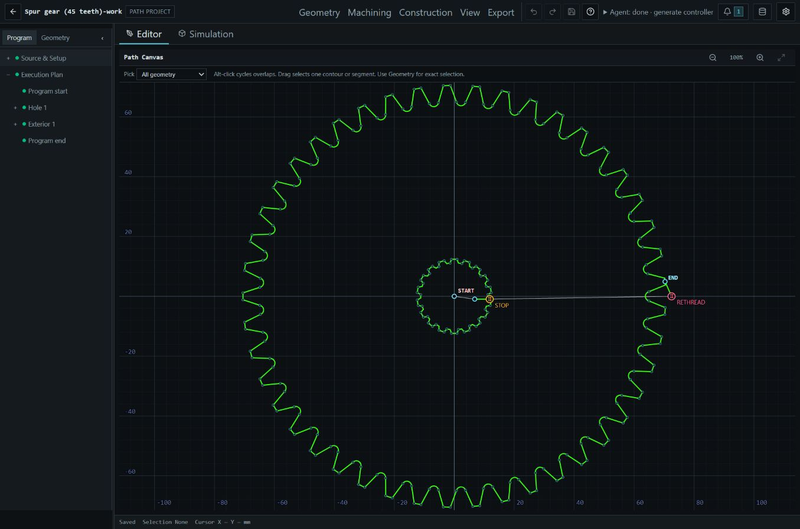
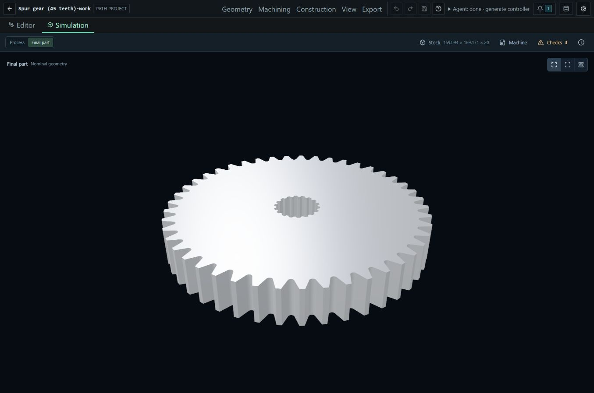

# Wire EDM Workbench

Plan wire EDM cuts in your browser. Bring in a drawing, set up the machining sequence, inspect the part in 3D and export a program for your machine.

[Open the app](https://insignifi4nt.github.io/wireedm-gcode-parser/) · [Read the guides](https://insignifi4nt.github.io/wireedm-gcode-parser/documentation/)

Import DXF drawings, reopen saved projects or work with existing machine programs. Set the cut order, entry points, compensation and stops directly on the part, with undo and redo when you need them.

Play through the saved process with rough stock, inspect cutouts and isolate the finished part. You can also bring in a STEP model of your machine to check for possible interference. The preview helps you review the job; it does not replace checks on the actual machine.

Your work stays in your browser or an optional local folder. Export projects to move them elsewhere, and download backups to keep them safe. Controller output uses an installed package for your machine.

In compatible browsers, an agent can help import files, edit projects and export results through the app's tools.

[Agent guide](https://insignifi4nt.github.io/wireedm-gcode-parser/documentation/agents/) · [Machine packages](https://insignifi4nt.github.io/wireedm-gcode-parser/documentation/authoring/) · [Contributing](AGENTS.md)